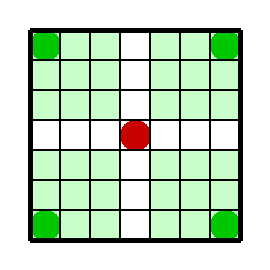
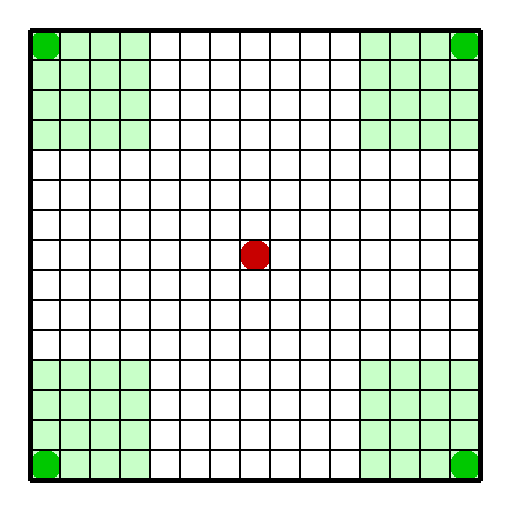

# INF581-Pursuit-Game-RL

Git repository of our project code : the RL-Pursuit-Game

##  What are the files ?

- env.py : contains the main environment with the grid, the actors, their actions and movements, the rewards, and a default random agent

- deterministic.py : contains the training algorithm using a deterministic approach

- q_learning_classical.py : contains the training algorithms using classical q-functions (SARSA and Q-Learning) with two methods of exploration (softmax and epsilon-greedy)

- deep_q_learning.py : contains the training algorithms using deep q-learning

- visualization.py : enables the animated display of the situation

## How to launch the code ?

Download all the python files in a folder. You can either launch the execution of "deterministic.py", "q_learning_classical.py" (you can choose the algorithm and the method of exploration that you want to launch at the beginning of the code) or "deep_q_learning.py" according to which of the three approaches you want to launch.

## Some fancy results :

A result obtained with SARSA and Softmax on a 7x7 grid with a field of vision of 2 cells:

A result obtained with Deep Q-Learning on 15x15 grid with a field of vision of 3 cells:

